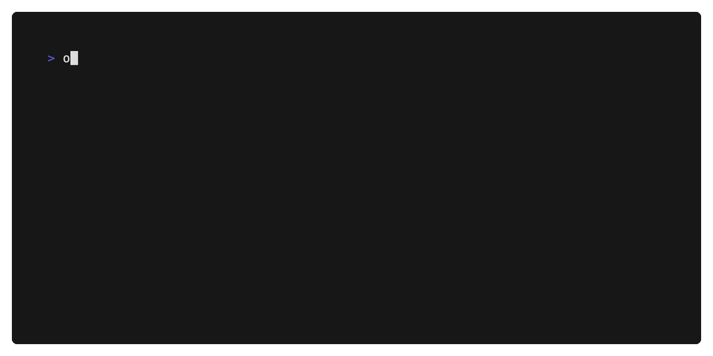

# OpenAI [](https://pkg.go.dev/github.com/picatz/openai) [](https://goreportcard.com/report/github.com/picatz/openai) [](https://opensource.org/licenses/MPL-2.0) 
 
An unofficial community-maintained Go client package and CLI for [OpenAI](https://openai.com/).

## Installation

To use this package in your own Go project:

```console
$ go get github.com/picatz/openai@latest
```

To use the `openai` CLI:

```console
$ go install github.com/picatz/openai/cmd/openai@latest
```

<center>
   </img>
</center>

> [!IMPORTANT] 
> To use the CLI you must have a valid `OPENAI_API_KEY` environment variable set. You can get one [here](https://platform.openai.com/).

> [!TIP]
> You can customize which model is used by setting the `OPENAI_MODEL` environment variable. The default is `gpt-4-turbo-preview` today, but it may change in the future.

## Usage

```go
import "github.com/picatz/openai"

client := openai.NewClient(os.Getenv("OPENAI_API_KEY"))
```

### Assistants API

```go
assistant, _ := client.CreateAssistant(ctx, &openai.CreateAssistantRequest{
	Model:        openai.ModelGPT4TurboPreview,
	Instructions: "You are a helpful assistant for all kinds of tasks. Answer as concisely as possible.",
	Name:         "openai-cli-assistant",
	Description:  "A helpful assistant for all kinds of tasks.",
	Tools: []map[string]any{
		{
			"type": "code_interpreter",
		},
		{
			"type": "retrieval",
		},
		// {
		// 	"type": "function",
		//  ...
		// },
	},
})

thread, _ := client.CreateThread(ctx, nil)

client.CreateMessage(ctx, &openai.CreateMessageRequest{
	ThreadID: thread.ID,
	Role:     openai.ChatRoleUser,
	Content:  input,
})

runResp, _ := client.CreateRun(ctx, &openai.CreateRunRequest{
	ThreadID:    thread.ID,
	AssistantID: assistant.ID,
})

openai.WaitForRun(ctx, client, thread.ID, runResp.ID, 700*time.Millisecond)

listResp, _ := client.ListMessages(ctx, &openai.ListMessagesRequest{
	ThreadID: thread.ID,
	Limit:    1,
})

fmt.Println(listResp.Data[0].Content[0].Text())
```

### Chat API

```go
var history []openai.ChatMessage{
	{
		Role:    openai.ChatRoleSystem,
		Content: "You are a helpful assistant for this example.",
	},
	{
		Role:    openai.ChatRoleUser,
		Content: "Hello!", // Get input from user.
	},
}

resp, _ := client.CreateChat(ctx, &openai.CreateChatRequest{
	Model: openai.ModelGPT35Turbo,
	Messages: history,
})

fmt.Println(resp.Choices[0].Message.Content)
// Hello how may I help you today?

// Update history, summarize, forget, etc. Then repeat.
history = appened(history, resp.Choices[0].Message)
```

### `openai` CLI

Use OpenAI's chat or edit and completion features on the command-line.

```console
$ go install github.com/picatz/openai/cmd/openai@latest
```

#### Modes

* **Assistant**: assistant mode is enabled using the `assistant` command line argument, this is the mode you want to use.
* **Chat**: chat mode is enabled using the `chat` command line argument. This mode is not reccomended for most users.

```console
$ openai chat

Welcome to the OpenAI API CLI assistant mode!
                                             
WARNING: Messages and files disappear after exiting.

> Hello!

Hello there! How may I assist you today?

...
```

```console
$ openai chat

Welcome to the OpenAI API CLI chat mode. Type 'exit' to quit.

> Hello!

Hello there! How may I assist you today?

...
```
